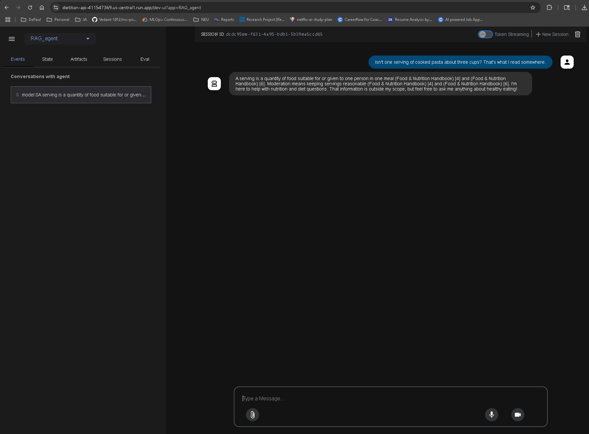
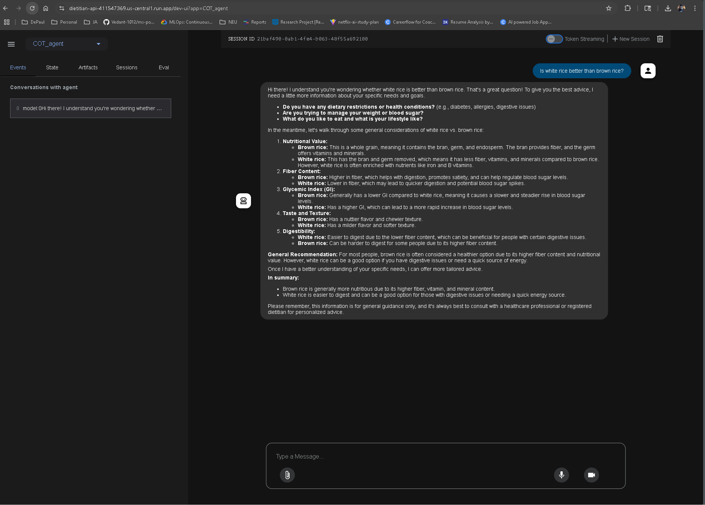
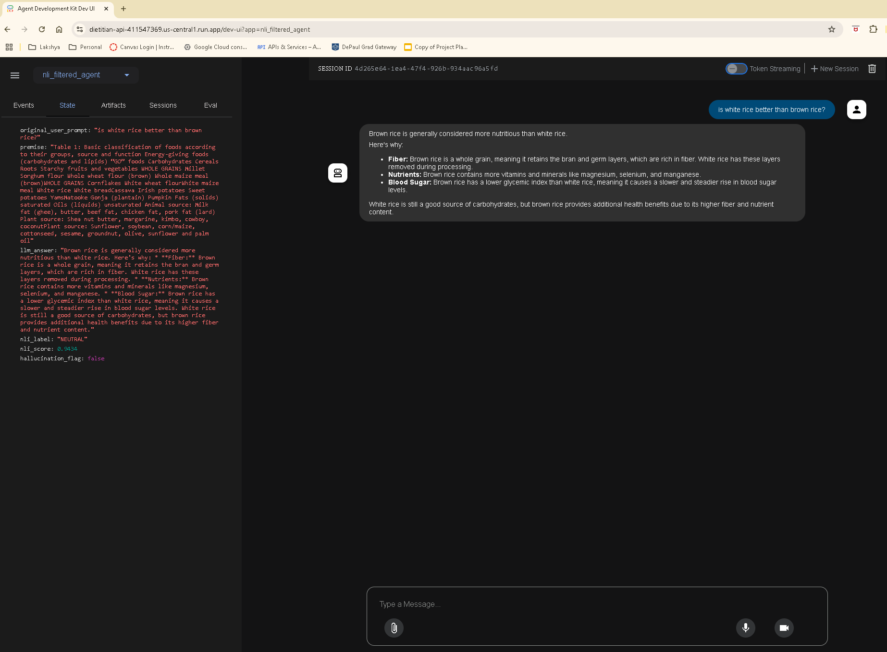
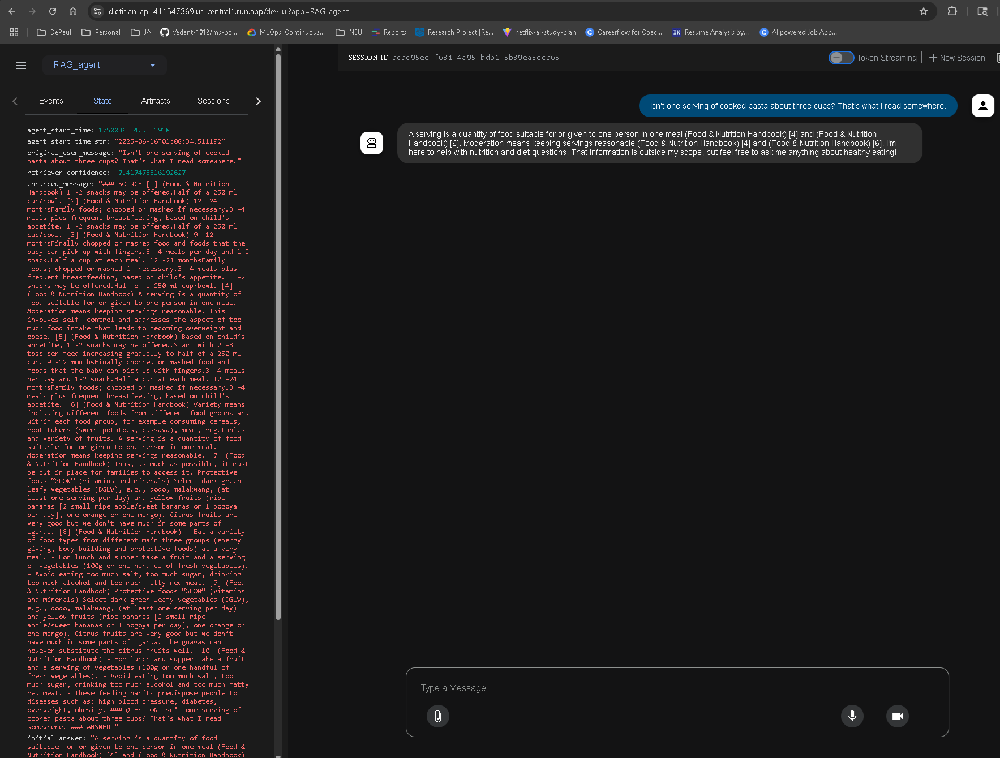

# Hallucination Mitigation Research Project

## Project Overview

This project implements a hallucination mitigation research framework using Google's Agent Development Kit (ADK). The primary goal is to explore and compare different agent architectures—specifically RAG (Retrieval-Augmented Generation), CoT (Chain-of-Thought), and NLI (Natural Language Inference) filtered agents—in their ability to reduce hallucinations in AI-powered chatbots. The system provides a web-based interface for interacting with these agents and visualizing their reasoning processes, resources used, and final answers, thereby offering insights into their hallucination mitigation strategies.

## Deployed Application

The application is currently deployed and accessible via the following link:

[https://dietitian-api-411547369.us-central1.run.app/dev-ui?app=RAG_agent](https://dietitian-api-411547369.us-central1.run.app/dev-ui?app=RAG_agent)


## High-Level Design

The system is designed around a modular architecture, leveraging Google's ADK to facilitate the development and deployment of various agent types. At a high level, the architecture consists of:

1.  **Agent Development Kit (ADK) Core**: Provides the foundational framework for building, testing, and deploying AI agents.
2.  **Multiple Agent Implementations**: Separate modules for RAG, CoT, and NLI-filtered agents, each designed to address hallucination through distinct mechanisms.
3.  **Web User Interface (UI)**: A Gradio-based interface (as suggested by the previous README) that allows users to select an agent, input queries, and view the agent's responses, including detailed state information (reasoning, resources, final answer).
4.  **Data Management**: Handles the ingestion and processing of knowledge bases (e.g., `nutrition_handbook.pdf` for the RAG agent) and manages test prompts and results.
5.  **Evaluation and Monitoring**: Tools and frameworks (as indicated by the `batch_test.py` and `results` directories) for evaluating agent performance and tracking metrics related to hallucination.

This high-level design emphasizes flexibility and extensibility, allowing for easy integration of new agent types and evaluation methodologies.

## Low-Level Design

### Agent Implementations

Each agent (RAG, CoT, NLI-filtered) is implemented as a distinct ADK agent, typically residing in its own directory (e.g., `RAG_agent`, `COT_agent`, `nli_filtered_agent`).

*   **RAG Agent**: This agent likely utilizes the `rag` subdirectory, which contains `embed_pdf.py` for embedding document content (e.g., `nutrition_handbook.pdf`) and `retriever.py` for retrieving relevant information based on user queries. The `agent.py` file orchestrates the retrieval and generation process.
*   **CoT Agent**: The `COT_agent` directory contains `agent.py` and `batch_test.py`. The CoT agent is expected to generate intermediate reasoning steps to arrive at a final answer, which can be inspected in the UI's state section.
*   **NLI-Filtered Agent**: The `nli_filtered_agent` includes `nli_verifier.py` and `rag_wrapper.py`, suggesting that it uses Natural Language Inference to verify the factual consistency of generated responses, potentially filtering out hallucinated content. It also appears to leverage a knowledge base (`full_nutrition_knowledge_base.txt`) and a retriever.

### Data Flow

1.  **User Query**: A user submits a query through the web UI.
2.  **Agent Selection**: The UI routes the query to the selected ADK agent (RAG, CoT, or NLI-filtered).
3.  **Agent Processing**: The selected agent processes the query. This may involve:
    *   **Retrieval**: For RAG and NLI-filtered agents, relevant information is retrieved from their respective knowledge bases.
    *   **Reasoning**: CoT agents generate a chain of thought.
    *   **Verification**: NLI-filtered agents perform factual verification.
4.  **Response Generation**: The agent generates a response based on its processing.
5.  **State Information**: During processing, the agent populates a 'state' object with details like `reasoning`, `resources`, and `final_answer`. This state is then displayed in the UI.
6.  **UI Display**: The UI renders the agent's response and the detailed state information, allowing users to understand the agent's internal workings and hallucination mitigation strategies.

### Dockerization

The `Dockerfile` at the root of the `TestSuite` directory indicates that the entire application can be containerized, ensuring consistent environments for development, testing, and deployment. The `requirements.txt` lists all necessary Python dependencies.


## Getting Started

To run this project locally, you will need to have Google's Agent Development Kit (ADK) installed, along with Python and Docker.

### Prerequisites

*   **Python 3.9+**: Ensure you have a compatible Python version installed.
*   **Google ADK**: Install the ADK by following the official documentation. You can typically install it via pip:
    ```bash
    pip install google-adk
    ```
*   **Docker**: For building and running the application in a containerized environment.

### Local Installation and Setup

1.  **Clone the repository (or extract the provided `TestSuite.zip`):**
    If you received a `.zip` file, extract it to your desired working directory. If it's a Git repository, clone it:
    ```bash
    git clone https://github.com/jskoerner/TestSuite.git
    cd TestSuite
    ```
    *Note: The provided `TestSuite.zip` contains a nested `TestSuite` directory. Navigate into the inner `TestSuite` directory after extraction.* For example, if you extracted to `/home/ubuntu/TestSuite`, then `cd /home/ubuntu/TestSuite/TestSuite`.

2.  **Install Python dependencies:**
    Navigate to the root of the `TestSuite` project (where `requirements.txt` is located) and install the required packages:
    ```bash
    pip install -r requirements.txt
    ```

3.  **Run the ADK web interface:**
    From the root of the `TestSuite` project, execute the following command to start the ADK web interface:
    ```bash
    adk web
    ```
    This will typically launch the web interface in your browser at `http://localhost:8000` (or a similar port).

### Building and Running with Docker

To containerize the application using Docker, follow these steps from the root of the `TestSuite` project (where the `Dockerfile` is located):

1.  **Build the Docker image:**
    ```bash
    docker build -t hallucination-mitigation-adk .
    ```

2.  **Run the Docker container:**
    ```bash
    docker run -p 8000:8000 hallucination-mitigation-adk
    ```
    This will map port 8000 from the container to port 8000 on your local machine, allowing you to access the ADK web interface at `http://localhost:8000`.


## Usage

Once the ADK web interface is running (either locally via `adk web` or through Docker), you can interact with the different agents:

1.  **Access the Web Interface**: Open your web browser and navigate to `http://localhost:8000` (or the URL provided by `adk web`).

2.  **Select an ADK Agent**: On the left-hand side of the interface, you will find a dropdown menu. From this dropdown, you can select the desired ADK agent to interact with. The available agents are typically:
    *   `RAG_agent` (Retrieval-Augmented Generation)
    *   `CoT_agent` (Chain-of-Thought)
    *   `nli_filtered_agent` (Natural Language Inference filtered)

3.  **Interact with the Chatbot**: Once an agent is selected, you can type your queries into the chat input field at the bottom of the screen and press Enter.

4.  **Analyze the State Section**: The right-hand side of the interface features a "State" section. This section is crucial for understanding the agent's internal workings and hallucination mitigation process. It provides:
    *   **Reasoning**: The steps or logic the agent followed to arrive at its answer.
    *   **Resources**: The external information or knowledge base entries the agent utilized.
    *   **Final Answer**: The agent's ultimate response to your query.

This detailed state information allows for a transparent analysis of how each agent addresses potential hallucinations and provides its answer.


## Demo Images

Here are some screenshots illustrating the application's interface and functionality:

### RAG Agent Interface


### CoT Agent Interaction


### NLI Filtered Agent Interaction


### Agent State Section



## Contributing

Contributions are welcome! If you have suggestions for improving this project, please feel free to:

1.  Fork the repository.
2.  Create a new branch (`git checkout -b feature/YourFeature`).
3.  Make your changes.
4.  Commit your changes (`git commit -m 'Add some feature'`).
5.  Push to the branch (`git push origin feature/YourFeature`).
6.  Open a Pull Request.

## License

This project is licensed under the MIT License - see the `LICENSE` file for details.


## Deployment

The application is deployed on Google Cloud Run and can be accessed at:

[https://dietitian-api-411547369.us-central1.run.app/dev-ui?app=RAG_agent](https://dietitian-api-411547369.us-central1.run.app/dev-ui?app=RAG_agent)


